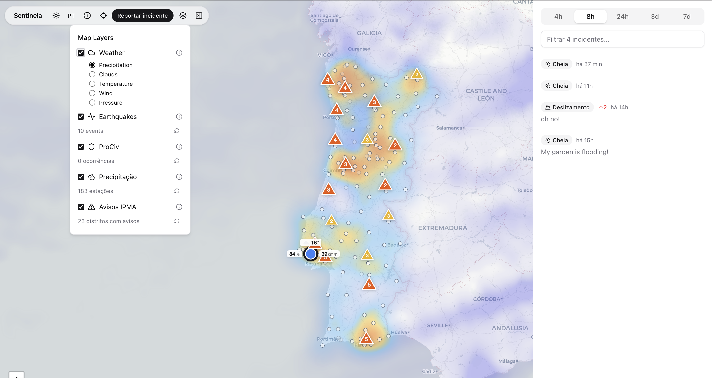

# Sentinela

Crowdsourced emergency reporting for Portugal. Citizens report incidents on an interactive map, the community validates them, and escalated reports reach local authorities.

**Live at [sentinela.help](https://sentinela.help)**



## Features

- **Report incidents** — pin fires, floods, landslides, storms, explosions, earthquakes, road closures on the map with photos and descriptions
- **Community validation** — escalate, de-escalate, comment, mark solved, or reopen reports
- **Government notification** — escalated incidents can be forwarded to local authorities via email/webhook
- **Real-time data overlays** — weather (OpenWeatherMap), seismic activity (USGS), civil protection incidents (Fogos.pt/ProCiv), rainfall (IPMA), weather warnings (IPMA)
- **Multi-language** — Portuguese and English
- **Mobile-first** — responsive design with dark mode

## Stack

- **Next.js 16** (App Router) + **React 19** + **TypeScript**
- **Tailwind CSS 4** + **shadcn/ui** (Radix)
- **Leaflet** + **react-leaflet** (maps, clustering, heatmaps)
- **Prisma 7** + **PostgreSQL** (via `pg` driver adapter)
- **Vercel Blob** (image storage in production)
- **next-intl** (i18n)

## Local development

1. Install deps

```bash
pnpm install
```

2. Configure env

```bash
cp .env.example .env
```

Edit `.env` — add your [OpenWeatherMap API key](https://openweathermap.org/api) (free tier) if you want weather overlays. All other data sources require no keys.

3. Start Postgres (requires Docker Desktop)

```bash
docker compose up -d db
```

> This maps Postgres to `localhost:5433` to avoid clashing with a locally installed Postgres on `5432`.

4. Run migrations + generate client

```bash
pnpm db:migrate
pnpm db:generate
```

5. Start the app

```bash
pnpm dev
```

Open [http://localhost:3000](http://localhost:3000).

## Data Sources

| Layer | Source | Key Required |
|-------|--------|:---:|
| Weather | [OpenWeatherMap](https://openweathermap.org) | Yes (free tier) |
| Earthquakes | [USGS Earthquake Hazards](https://earthquake.usgs.gov) | No |
| Civil Protection | [Fogos.pt](https://fogos.pt) | No |
| Rainfall | [IPMA](https://api.ipma.pt) | No |
| Weather Warnings | [IPMA](https://api.ipma.pt) | No |

## Notes

- Uploads are saved to `public/uploads/` in local dev (ignored by git). In production, Vercel Blob is used for object storage.
- To enable address lookup (reverse geocoding), set `ENABLE_NOMINATIM=true` and provide a descriptive `NOMINATIM_USER_AGENT` in `.env`.

## Contributing

Contributions are welcome! Feel free to open issues or submit pull requests.

1. Fork the repo
2. Create a feature branch (`git checkout -b feature/my-feature`)
3. Commit your changes
4. Push and open a PR

## License

[MIT](LICENSE)
